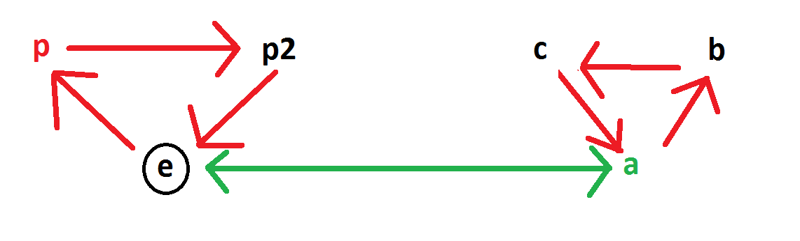

```{r setup, include=FALSE}
knitr::opts_chunk$set(echo = TRUE)
```

# Group definition

Let G be a finite set with an application $\cdot: G\times G \rightarrow G$. $(G,  \cdot)$ is a group iff:

* **Identity** There exists an element we call e such that $\forall g \in G, e \cdot g = g \cdot e = g$
* **Transitivity** $\forall g, h, k \in G, (g \cdot h) \cdot k = g \cdot (h \cdot k)$
* **Inverse** $\forall g \in G, \exists h \in G / gh = hg = e$

We easily show that if there is an identity it must be unique, and that the inverse of an element is also unique.

## Opposite group

If $(G, \cdot)$ is a group then we can construct the opposite group $(G, \cdot_{op})$ the following way:

$$g \cdot_{op} k \mapsto k \cdot g$$

And the isomorphism $G \rightarrow G^{op}$ is given by the identity?

$id(g \cdot k) = g \cdot k$ and $id(g \cdot k) = id(g) \cdot_{op} id(k) = k \cdot g$

Nope it is not.

The isomorphism is given by the map $g \mapsto g^{-1}$ :

$(g \cdot k)^-1 = k^{-1} \cdot g^{-1}$ and $(g \cdot k)^-1 = g^{-1} \cdot_{op} k^{-1} = k^{-1} \cdot g^{-1}$

## Conjugation

For any g in G we can define: $h^g \mapsto ghg^{-1}$ and $h^{*g} \mapsto g^{-1}hg$

Let's show that both are automorphisms:

$$h^gk^g = ghg^{-1}gkg^{-1} = ghkg^{-1} = (hk)^g$$
So the conjugation is an automorphism.

$$h^{*g}k^{*g} = g^{-1}hgg^{-1}kg = g^{-1}hkg = (hk)^{*g}$$
So the opposite conjugation is also an automorphism.

### As a homomorphism G into Aug(G)
We also get 2 mappings

$$\begin{array}{ll}
conj: G \rightarrow Aut(G) \\
g \mapsto (x \mapsto x^g)
\end{array}$$

and 

$$\begin{array}{ll}
conj_{op}: G \rightarrow Aut^{op}(G) \\
g \mapsto (x \mapsto x^{*g})
\end{array}$$

We can check that they are both homomorphisms:

$$conj(g_1) \circ conj(g_2)(x) = conj(g_1)(g_2x{g_2}^{-1}) = g_1g_2x{g_2}^{-1}{g_1}^{-1} = g_1g_2x(g_1g_2)^{-1} = conj(g_1g_2)(x)$$

And similarly for $conj_{op}$:

$$conj_{op}(g_1) \circ conj_{op}(g_2)(x) = conj_{op}(g_2)(conj_{op}(g_1)(x)) = conj(g_2)({g_1}^{-1}xg_1) = {g_2}^{-1}{g_1}^{-1}xg_1g_2 = {g_1g_2}^{-1}xg_1g_2 = conj_{op}(g_1g_2)(x)$$

### What is not homomorphism

This is the proof that $conj_{op}$ is not a homomorphism into Aut(G)
$$conj_{op}(g_1) \circ conj_{op}(g_2)(x) = conj(g_1)({g_2}^{-1}xg_2) = {g_1}^{-1}{g_2}^{-1}xg_2g_1 = {g_2g_1}^{-1}xg_2g_1 = conj(g_2g_1)(x)$$

Similarly we show that $conj$ is not a homomorphism into $Aut_{op}(G)$

# Symmetric group

Let A be any finite set. We define Aut(A) to be the group of all bijection $A \rightarrow A$

And we can define $\forall f, g \in \mathrm{Aut(A)}, \forall a \in A, f \circ g (a) = f(g(a))$ and $f \circ_{op} g(a) = g(f(a))$. These 2 groups are opposite of each other,

# Group action

Similarly we have 2 ways to define a group action of a group G into a set S.

We can define the group action as a morphism $G \rightarrow \mathrm{Aut(S)}$ or as a morphism $G \rightarrow \mathrm{Aut^{op}(S)}$

Let $\phi: G \rightarrow \mathrm{Aut^{op}(S)}$

Then we can define $\forall g \in G, x \in \mathcal{S}, g \bullet_{op}^2 x = \phi(g)(x)$
And we have $\phi(g_1 \cdot g_2)(x) = (\phi(g_1) \circ_{op}\phi(g_2)) (x) = \phi(g2)(\phi(g1)(x)) = \phi(g_2)(g_1 \bullet_{op}^2 x) = g_2 \bullet_{op}^2 g_1 \bullet_{op}^2 x$

But that doesn't work very well. We can try the following though:

$\forall g \in G, x \in \mathcal{S}, x \bullet_{op} g = \phi(g)(x)$

And we have $x \bullet_{op} g_1g_2= \phi(g_1 \cdot g_2)(x) = (\phi(g_1) \circ_{op}\phi(g_2)) (x) = \phi(g_2)(\phi(g_1)(x)) = \phi(g2)(x \bullet_{op} g_1) = x \bullet_{op} g_1 \bullet_{op} g_2$


# Semidirect product

Let G be a group, N a normal subgroup, K another subgroup such that $G = K \rtimes N$

## 2 ways to write the semidirect product

Let $n \in N, k \in k, g \in G$ Should we write g as nk or as kn?

if we write **g = nk** then: $g_1 \cdot g_2 = n_1k_1 \cdot n_2k_2 = n_1k_1n_2k_1^{-1}k_1k_2 = n_1(k_1n_2k_1^{-1}) \cdot k_1k_2$

$$(k_1, n_1) \cdot (k_2, n_2) = (k_1k_2, n_1k_1n_2k_1^{-1}) = (k_1k_2, n_1n_2^{k_1})$$

if we write **g = kn** then: $g_1 \cdot g_2 = k_1n_1 \cdot k_2n_2 = k_1k_2(k_2^{-1}n_1k_2) \cdot n_2$

$$(k_1, n_1) \cdot (k_2, n_2) = (k_1k_2, ({k_2}^{-1}n_1k_2)n_2) = (k_1k_2, {n_1}^{*k2}n_2)$$

Lot of possibilities:

* 2 ways to define the conjugation
* 2 ways to define the composition of functions
* 2 ways to define the semi-direct product
* 2 ways to define a group action

Are all those definition compatible?

We will show that once we choose an order for the composition of functions there is only one way to define composition and the semi-direct product such that

1. The map $g \mapsto conj(g)$ is a homomorphism
2. The semi-direct product read that way (g1g2, n1 conj(g1)(n2))

## Definition

Since the package *permutations* that I use uses the definition of composition corresponding to the group $Aut_{op}$ then:

* We define the conjugation as $conj_{op}(g)(x) = g^{-1}xg$ because that way the conjugation is a group homomorphism into $Aut_{op}(G)$

* We define the semidirect product as kn (normal term comes second) so that the map from k to Aut(N) is a group homomorphism.

## Properties

Let A, B and C be groups. $f: A \rightarrow C$, $g: B \rightarrow C$ then we have
$f \times g : A \times B \rightarrow C$

Note that this isnt true of the semi-direct product: $id_{C(3)}: C(3) \rightarrow C(3)$, and $0: C(2) \rightarrow C(3)$ but there is no map $S3 \rightarrow C(3)$.

**proof** Let l be such a map. C(3) is of order 3 so l(s) = 0. 
We also have l(r) = r.
Then l(srs) = l(s) + l(r) + l(s) = l(r) = 1
But we have also l(srs) = l(r^2) = 2l(r) = 2
Absurd! So l cannot be defined.

# Classes by a subgroup

Let H be a subgroup of G. We write $xH = \{xh | h\in H\}$ and $Hx = \{hx | h\in H\}$

**Lemma**  $x \in G, y \in xH$ then $xH = yH$

**Proof**

> $y \in xH \implies y = xh_y \implies yH = xh_yH = xH$

And similarly for the right classes.

**Property** $\{xH | x \in G\}$ is a partition of G.
 
**Proof**

> if xH and yH have non-null intersection then there is z in both xH and yH and according to the lemma xH = zH = yH and xH = yH. Furthermore the classes clearly cover the whole of G since $\forall g, g \in gH$

**Definition** For H subgroup of G we can define $x \sim_H y \iff \exists h \in H, x = yh$. And it is an equivalence relation. It is the equivalence relation induced by the partion of the left-classes.

**Proof**

> $x \sim_H y \iff x = yh \iff x \in yH$

# Group decomposition

Let G be a group, we assume

1. **H** is a normal subgroup.
2. $\kappa$ in **G/H** is normal in **G/H**

We write **K** be $\pi_H^{-1}\{\kappa\}$


Then

1. **K** is a normal subgroup of **G**
2. $G/K \sim \frac{G/H}{\kappa}$ or $\frac{G}{\kappa H} \sim \frac{G/H}{\kappa}$

## Other formulations

### Number 1: using $\kappa$
We have

$$ 0 \rightarrow H \rightarrow G \rightarrow G/H \rightarrow 0 $$


$$ 0 \rightarrow \kappa \rightarrow G/H \rightarrow \frac{G/H}{\kappa} \rightarrow 0 $$

then we can deduce


$$ 0 \rightarrow \pi_H^{-1}\{\kappa\} \rightarrow G \rightarrow \frac{G/H}{\kappa} \rightarrow 0 $$

### Number 2: using **K**

$$ 0 \rightarrow H \rightarrow G \rightarrow G/H \rightarrow 0 $$


$$ 0 \rightarrow KH \rightarrow G/H \rightarrow \frac{G/H}{KH} \rightarrow 0 $$

then we can deduce

$$ 0 \rightarrow K \rightarrow G \rightarrow \frac{G/H}{KH} \rightarrow 0 $$

## Proof

### Proof that **K** is normal in **G**

Let g \in **G** and k \in **K**
We want to show that $g^{-1}kg \in K$
$K=\pi_H^{-1}\{\kappa\}$ so we have
$$g^{-1}kg \in \pi_H^{-1}\{\kappa\} \iff \pi_H(g^{-1}kg) \in \kappa \iff \pi_H(g^{-1})\pi_H(k)\pi_H(g) \in \kappa$$


But $\pi_H(k) \in \kappa$ and since $\kappa$ is normal in **G/H** the last inclusion is true and we have proved that **K** is normal in **G**.

## Examples

## More group decomposition

I have a group G that I am trying to understand. I find a normal subgroup N in G.
Then I try to understand N and I try to understand G/N.
4 possibilities:

1. Both are simple
2. N is simple, G/N has a normal subgroup
3. N has a normal subgroup, G/N is simple
4. Both have normal subgroups

## Subset of Sn given by generators

Let's say that I have $g_1, \dots, g_k \in \mathrm{Sn}$ and I want to know the subgroup of Sn that they generate. That is I want to have a list of all the elements in $<g_1, \dots, g_k>$.

Finding a normal subgroup is useful for determining the number of elements in a group when we only know the generators. It is also useful for determining all the elements of said group.
For example let's say that I have a group generated by g, h. If I want to find all the elements one solution is to first take all the simple products:
e, g, h then compute
g2, gh, hg, h2 compare each with the first step (4*3 = 12 comparisons) if they are all inside the previous step then e, g, h forms a group. if not then commpute
g3, g2h, ghg, gh2, hg2, hgh, h3g, h3 if they are all in the previous steps (8*7 = 56 comparisons) then


### Examples

* When trying to understand S3 I find that <p> ~ Z/3Z is normal and that the quotient is ~ to Z/2Z. This is situation 1.

## Other examples of decompositions

* Z/4Z is a group of order 4. It has 4 elements {0, 1, 2, 3}. The subgroup {0, 2} is a normal subgroup (every subgroup is normal since the group is Abelian). The quotient has order 2 and so is isomorphic to Z/2Z. However Z/4Z is not a semi-direct product of {0, 2} since there are no other subgroups of order 2 inside Z/4Z.

The classes of (Z/4Z)/(Z/2Z) are {0, 2}, {1, 3}. 
The action of each element on the classes are:

| Z/4Z | {0, 2} | {1, 3} |
|------|--------|--------|
|  0   | {0, 2} | {1, 3} |
|  1   | {1, 3} | {2, 0} |
|  2   | {2, 0} | {3, 1} |
|  3   | {3, 1} | {0, 2} |


# Splitting lemma

## Examples

### Decomposition of C(4)

H = {0, 2} is normal in C(4) so we have the following exact sequence:

$$0 \rightarrow \{0, 2\} \rightarrow C(4) \rightarrow C(4)/\{0, 2\} \rightarrow 0$$

1. Let's check that this sequence doesn't split on the left
2. Let's check that this sequence doesn't split on the right

**proof of 1**
Let i be injection $\{0, 2\} \rightarrow C(4)$ and f be a group homomorphism $C(4) \rightarrow {0, 2}$

- if f(1) = 0 then f = 0 and if = 0
- if f(1) = 2 then if(2) = f(i(2)) = f(2) = 2f(1) = 0 and if = 0

Conclusion we cannot find f such that $if = id_{\{0, 2\}}$ so the sequence doesn't split on the left.

**proof of 2**
Let j be the natural projection on the quotient: $j(k) = k \cdot \{0, 2\}$ and let u be a group morphism $u: C(4)/\{0, 2\} \rightarrow C(4)$ such that $uj = id_{C(4)/H}$

So in particular we have: uj({1, 3}) = {1, 3}, meaning j(u({1, 3})) = {1, 3}
Meaning $u\{1, 3\} \in \{1, 3\}$. Which cannot be since the image of u must be a subgroup of order at most 2 and both 1 and 3 generate subgroups of order 4.

### Decomposition of S3

We use the following representation of S3: $<r^3, s^2, srs = r^2>$

$S3 \sim C(2) \rtimes C(3)$ via $S3 = <s> \rtimes <r>$

<r> is normal in S3 and we get the following sequence:

$$0 \rightarrow \langle r \rangle \rightarrow S3 \rightarrow S3/\langle r \rangle \rightarrow 0$$

Let's show that this sequence is **not left-split** 

let f be such that $if = id_{r}$ Then we have:

f(i(r)) = r implies f(r) = r
secondly f(s) = 0 because <r> is of order 3 and s is of order 2.

There cannot be any morphism verifying this! So the sequence is not left split

Let's now show that this sequence is **right split**

$S3/<r> = \{\{e, r, r^2\}, \{s, sr, sr^2\}\}$

## Right splitting

If the following exact sequence:

$$0 \rightarrow K \rightarrow G \rightarrow Q \rightarrow 0$$
Is right-split, then G is isomorphic to $Q \rtimes K$

Let u be the splitting application $u\pi = id_{Q}$

The condition that this is sequence is right-split is kinda equivalent to saying that there is a copy of Q in G that is 'perpendicular' to H.

Or it is like saying that I can quotient G by K and I can find a copy of the quotient in G. The application u is an application that takes one element from each class of the quotient. So it gives a system of representation of Q in G, that is also a group.

We need to show that

1. Every element in G can be written as a composition $i(k)u(q), k \in K, q \in Q$
2. $i(K) \cap u(Q) = \emptyset$
3. i(K) is normal in G

**proof of point 1**

Let g in G.

Let's show that $g \cdot u(\pi(g))^{-1} \in i(K)$

Indeed we have $\pi(g \cdot u(\pi(g))^{-1}) = \pi(g) \cdot \pi(u(\pi(g))^{-1})) \\
= \pi(g) \cdot \pi(g)^{-1}) = e$

So $g \cdot u(\pi(g))^{-1} \in Ker(\pi) \implies g \cdot u(\pi(g))^{-1} \in Im(i)$

So there exists k in K such that $g \cdot u(\pi(g))^{-1} = i(k) \implies g = i(k)u(\pi(g))$

**proof of point 2**

Let $g \in i(K) \cap u(Q)$ so $g \in Ker(\pi) \cap u(Q)$

So there exists q such as: u(q) = g. And we have $u\pi(q) = q = \pi(u(q)) = \pi(g) = e$

So q = e, so g = u(q) = e

**proof of point 3**

According to the exactness of the sequence: $Im(i) = Ker(\pi)$ so $i(K) = Ker(\pi)$
and i(K) is normal.

## Left splitting

If the sequence is left-split then it is like we project G unto K and unto Q. Then we can project G unto $K \times Q$ turns out that this map is an isomorphism. #lol

$$G \rightarrow K \rightarrow 0$$

So the proof is finished! What we learned from the proof is that when we have a semi-direct quotient then we can decompose each element of the group G. For that we use the quotient map to find out the class then we use the u function to give us a representative in G that we write q. The find the kernel part we use the equation g = qn which is solvable since we know both q and g.

# Generator graphs

## General rules

1 generator each has 1 color.
The points of the graphs are the elements of the group.
The directed edges are of the form (k,kg) where k is any element in the group and g is any generator. The color of the arc (k, kg) is the color associated with the generator.

## For a cyclic group

_gen_graph.png)

We usually put the elements of a cyclic group in a line.

## Product of a group and a cyclic group kernel

We have 2 choices. Here is the example with S3

* This is the product correct way:


* This is the straight edge way:




# All Subgroups of a Group

Let G be a group, let $0 \rightarrow N \rightarrow G \rightarrow Q \rightarrow 0$ be a decomposition.

## Finding All the Normal Subgroups

We assume that we know all the normal subgroups of N and Q.
