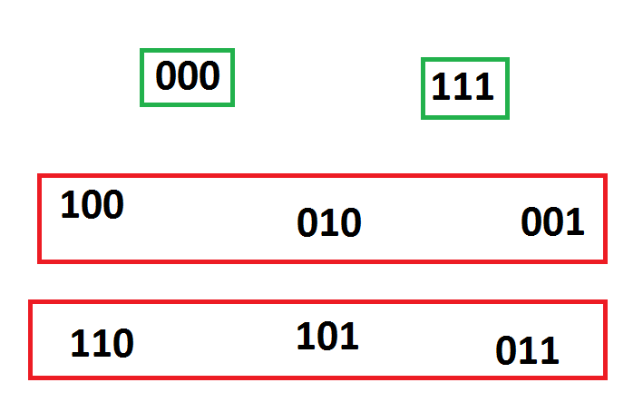

```{r setup, include=FALSE}
knitr::opts_chunk$set(echo = TRUE)
```

## Definition of a beat

* A beat always loop on itself. We define the count of a beat as the minimum number of rhythms or notes that repeat itself.

* A beat can be composed of several instruments or drums. Usually we note 0 for the silence. Then we note different drums with numbers 1, 2... For example a beat with 2 druns 1 and 2 is said to be a beat played with {0, 1, 2} since it is also possible to have silence (not play any instruments).

* A beat can play several instruments at once, or 0. But for simplification we consider that a beat can only play **one instrument at a time**. This is not a big restriction because we can alway consider that a combination of 2 instrument at the same time is a new instrument? This is still to explore.

* We say that 2 beat are the same if they produce the same sound. That means that one beat and the same but shifted in time are considered the same (they sound the same).

## Strategy to understand beats

1. Understand all the beat with 1 instrument for 2 counts, 3 counts, 4 counts and 5 counts.
2. List and understand all the beats with 1 instrument
3. Same 2 steps but considering the additional symmetry on instruments
4. Same 2 steps but considering the additional symmetry on scale
5. Same 2 steps but considering the additional symmetry of time-reversal
6. Combination of the additional symmetry together
7. Define the fixed group of a beat as a subset of Z/4Z (if 4 counts)

## Examples


[Dad beat](https://splice.com/sounds/beatmaker/e54120e49581)


## Let's try something


What are the subsets of Z/16Z that leave this beat unchanged?

We note 0 for the silence and 1 for the bass sound. Then we have:

| **1** | 2 | 3 | 4 | **5** | 6 | 7 | 8 | **9** | 10 | 11 | 12 | **13** | 14 | 15 | 16 |
|-------|---|---|---|-------|---|---|---|-------|----|----|----|--------|----|----|----|
| 1     | 0 | 0 | 0 | 1     | 0 | 0 | 0 | 1     | 0  | 0  | 0  | 1      | 0  | 0  | 0  |

We call this function f. $f: \{1, \dots, 16\} \rightarrow \{0, 1\}$

We note Fx(f, Z/16Z):
$$\left\{g \in \mathrm{Z/16Z} | \forall x \in \{1 \dots 16\}, f(g \bullet x) = f(x)\right\}$$

**Necessary condition**

Let $g \in \mathrm{Fx(f, Z/16Z)}$, g is uniquely determined by it's image of 1. $f(g \bullet 1) = f(1) = 1$, so we know that $g \bullet 1 \in \{1, 5, 9, 13\}$.

**Sufficient condition**

Let's show that $g: x \mapsto x+4$ is in $\mathrm{Fx(f, Z/16Z)}$.

| Beat          | **1** | 2 | 3 | 4 | **5** | 6 | 7 | 8 | **9** | 10 | 11 | 12 | **13** | 14 | 15 | 16 |
|---------------|-------|---|---|---|-------|---|---|---|-------|----|----|----|--------|----|----|----|
| **f(beat)**   | 1     | 0 | 0 | 0 | 1     | 0 | 0 | 0 | 1     | 0  | 0  | 0  | 1      | 0  | 0  | 0  |
| **f(5+beat)** | 1     | 0 | 0 | 0 | 1     | 0 | 0 | 0 | 1     | 0  | 0  | 0  | 1      | 0  | 0  | 0  |

So $g \in \mathrm{Fx(f, Z/16Z)}$. And g has order 4 so
$$\mathrm{Fx(f, Z/16Z)} = \{+0, +4, +8, +12\} \sim \mathrm{Z/4Z}$$

Let's do the same but with half of the basic beat:

| **1** | 2 | 3 | 4 | **5** | 6 | 7 | 8 |
|-------|---|---|---|-------|---|---|---|
| 1     | 0 | 0 | 0 | 1     | 0 | 0 | 0 | 

We are now looking for Fx(f, Z/8Z). As before the necessary condition is that $g \bullet 1 \in \{1, 5\}$ and we show that this condition is sufficient. So this time $\mathrm{Fx(f, Z/8Z)} = {+0, +2} \sim \mathrm{Z/2Z}$

We observe that

## Beats on 4 counts with 1 instrument


Each beat is a function $f: \{1, \dots 4\} \rightarrow \{0, 1\}$
We say that 2 functions f, g define the same beat iff there exist $a \in Z/4Z, \forall x \in \{1, \dots 4\}, f(x) = g(a \bullet x)$.

We verify that 'defining the same beat' is an equivalence relation on the functions $\{1, \dots 4\} \rightarrow \{0, 1\}$.

**Property**
If 2 functions define the same beat then the equivalent classes each of them define have the same cardinal. And a the associated mapping.

*Proof*

> Let f, g define the same beat
> $|f^{-1}\{0\}| = |\{x \in \{1, \dots 4\}/ f(x) = 0\}| = |\{x \in \{1, \dots 4\}/ g(a + x) = 0\}| = |\{x \in \{1, \dots 4\}/ g(x) = 0\}|$
> Since $x \mapsto a + x$ is an isomorphism of \{1, \dots 4\}

**Reformulation of the problem**
We can define an action Z/4Z on $\{1, \dots 4\} \rightarrow \{0, 1\}$ by $a \bullet f = x \mapsto f(a \bullet x)$ for $a \in Z/4Z$.

*proof*

> $0 \bullet f = f$  
> $(a+b) \bullet f = a \bullet (b \bullet f)$

And 2 functions define the same beat iff there exists a such that  $a \bullet f = g$, said differently if they belong to the same orbit by the action just defined. So we are trying to find all the orbits of this action.

### Intuition

1. Beats with 1-cardinal 0

| Beat | 1 | 2 | 3 | 4 |
|------|---|---|---|---|
| f    | 0 | 0 | 0 | 0 |

2. Beats with 1-cardinal 1

| Beat | 1 | 2 | 3 | 4 |
|------|---|---|---|---|
| f    | 1 | 0 | 0 | 0 |

3. Beats with 1-cardinal 2

$P_2 = 1$

| Beat | 1 | 2 | 3 | 4 |
|------|---|---|---|---|
| f    | 1 | 1 | 0 | 0 |

$P_2 = 0$

| Beat | 1 | 2 | 3 | 4 |
|------|---|---|---|---|
| f    | 1 | 0 | 1 | 0 |

4. Beats with 1-cardinal 3

$P_2 = 2$
$P_3 = 1$

| Beat | 1 | 2 | 3 | 4 |
|------|---|---|---|---|
| f    | 1 | 1 | 1 | 0 |

5. Beast with 1-cardinal 4

| Beat | 1 | 2 | 3 | 4 |
|------|---|---|---|---|
| f    | 1 | 1 | 1 | 1 |

So our intuition tells us that there are 6 beats using 1 instrument on a count of 4.

### Demonstration

1. First let's take care of the easy cases. If the 1-cardinal of f is 0 or 4 the f is the constant function equal to 0 or 1 respectively. So there is exactly one beat of 1 cardinal 0 and one beat of 1 cardinal 4.

2. Now let's assume the the 1-cardinal of f is in {1, 2, 3}. We want to show that there exists a function g defining the same beat as f that starts with 0 and 1.
* If f starts with 01 the result is true already.
* If f starts with 00 then there must be i in {3, 4 such that} f(i) = 1 and f(i-1) = 0. (otherwise the function would be constant = 0 and its 1 cardinal would be 0). We verify that the function 
$g = (i-1) \bullet f$ starts with 01. Indeed $g(0) = f(i - 1) = 0$ and
$g(1) = f(i) = 1$.
* If f starts with 1 there is one i in {2, 3, 4} such that f(i) = 0 otherwise the 1-cardinal of f would be 4. By posing $g = i \bullet f$ we go back to one of the preceding case.

If f has 1-cardinal 1 then it has only one 1. Since there is one g defining the same beat as f starting with 01 we know that it has to be 0100. So there is only one beat with 1 cardinal 1.

Similarly there is only one beat with 1-cardinal 3.

And finally we show that there are at most 2 beats with 1-cardinal 2 (the one we showed in the intuition part). We need to show that these 2 beats are not the same.

## Beats on 3 counts



* 1-cardinal is 0

| Beat | 1 | 2 | 3 |
|------|---|---|---|
| f    | 0 | 0 | 0 |

* 1-cardinal is 1

| Beat | 1 | 2 | 3 |
|------|---|---|---|
| f    | 1 | 0 | 0 |

* 1-cardinal is 2

| Beat | 1 | 2 | 3 |
|------|---|---|---|
| f    | 1 | 1 | 0 |

* 1-cardinal is 3

| Beat | 1 | 2 | 3 |
|------|---|---|---|
| f    | 1 | 1 | 1 |

Total 4

## Beats on 2 counts


* 1-cardinal is 0

| Beat | 1 | 2 |
|------|---|---|
| f    | 0 | 0 |

* 1-cardinal is 1

| Beat | 1 | 2 |
|------|---|---|
| f    | 1 | 0 |

* 1-cardinal is 2

| Beat | 1 | 2 |
|------|---|---|
| f    | 1 | 1 |

## Beats on 5 counts

* 1-cardinal is 0

| Beat | 1 | 2 | 3 | 4 | 5 |
|------|---|---|---|---|---|
| f    | 0 | 0 | 0 | 0 | 0 |

* 1-cardinal is 1

| Beat | 1 | 2 | 3 | 4 | 5 |
|------|---|---|---|---|---|
| f    | 1 | 0 | 0 | 0 | 0 |

* 1-cardinal is 2

$P_2 = 1$

| Beat | 1 | 2 | 3 | 4 | 5 |
|------|---|---|---|---|---|
| f    | 1 | 1 | 0 | 0 | 0 |

$P_2 = 0$

| Beat | 1 | 2 | 3 | 4 | 5 |
|------|---|---|---|---|---|
| f    | 1 | 0 | 1 | 0 | 0 |

* 1-cardinal is 3

$P_3 = 1, P_2 = 2$

| Beat | 1 | 2 | 3 | 4 | 5 |
|------|---|---|---|---|---|
| f    | 0 | 0 | 1 | 1 | 1 |

$P_3 = 0, P_2 = 1$

| Beat | 1 | 2 | 3 | 4 | 5 |
|------|---|---|---|---|---|
| f    | 0 | 1 | 0 | 1 | 1 |

* 1-cardinal is 4

$P_4 = 1, P_3 = 2, P_2 = 3, P_1 = 4$
| Beat | 1 | 2 | 3 | 4 | 5 |
|------|---|---|---|---|---|
| f    | 1 | 1 | 1 | 1 | 0 |

* 1-cardinal is 5

$P_5 = 5, P_4 = 5, P_3 = 5, P_2 = 5, P_1 = 5$

| Beat | 1 | 2 | 3 | 4 | 5 |
|------|---|---|---|---|---|
| f    | 1 | 1 | 1 | 1 | 1 |

Total is 8 beats

## Beats on 6 counts

* 1-cardinal is 0

| Beat | 1 | 2 | 3 | 4 | 5 | 6 |
|------|---|---|---|---|---|---|
| f    | 0 | 0 | 0 | 0 | 0 | 0 |

* 1-cardinal is 1

| Beat | 1 | 2 | 3 | 4 | 5 | 6 |
|------|---|---|---|---|---|---|
| f    | 1 | 0 | 0 | 0 | 0 | 0 |

* 1-cardinal is 2

$P_2 = 1$

| Beat | 1 | 2 | 3 | 4 | 5 | 6 |
|------|---|---|---|---|---|---|
| f    | 1 | 1 | 0 | 0 | 0 | 0 |

$P_2 = 0$

| Beat | 1 | 2 | 3 | 4 | 5 | 6 |
|------|---|---|---|---|---|---|
| f    | 1 | 0 | 1 | 0 | 0 | 0 |

$P_2 = 0$

| Beat | 1 | 2 | 3 | 4 | 5 | 6 |
|------|---|---|---|---|---|---|
| f    | 1 | 0 | 0 | 1 | 0 | 0 |

* 1-cardinal is 3

$P_3 = 1, P_2 = 2$

| Beat | 1 | 2 | 3 | 4 | 5 | 6 |
|------|---|---|---|---|---|---|
| f    | 1 | 1 | 1 | 0 | 0 | 0 |

$P_3 = 0, P_2 = 1$

| Beat | 1 | 2 | 3 | 4 | 5 | 6 |
|------|---|---|---|---|---|---|
| f    | 1 | 1 | 0 | 1 | 0 | 0 |

$P_3 = 0, P_2 = 1$

| Beat | 1 | 2 | 3 | 4 | 5 | 6 |
|------|---|---|---|---|---|---|
| f    | 1 | 1 | 0 | 0 | 1 | 0 |

$P_3 = 0, P_2 = 0$

| Beat | 1 | 2 | 3 | 4 | 5 | 6 |
|------|---|---|---|---|---|---|
| f    | 1 | 0 | 1 | 0 | 1 | 0 |

Total is 14

Those are just the 'opposite beats'. We can check them out:

* 1-cardinal is 4

$P_4 = 1, P_3 = 2, P_2 = 3$

| Beat | 1 | 2 | 3 | 4 | 5 | 6 |
|------|---|---|---|---|---|---|
| f    | 0 | 0 | 1 | 1 | 1 | 1 |

$P_4 = 0, P_3 = 1, P_2 = 2$

| Beat | 1 | 2 | 3 | 4 | 5 | 6 |
|------|---|---|---|---|---|---|
| f    | 0 | 1 | 0 | 1 | 1 | 1 |

$P_4 = 0, P_3 = 0, P_2 = 2$

| Beat | 1 | 2 | 3 | 4 | 5 | 6 |
|------|---|---|---|---|---|---|
| f    | 0 | 1 | 1 | 0 | 1 | 1 |


## Beats on 7 counts

* 1-cardinal is 0

| Beat | 1 | 2 | 3 | 4 | 5 | 6 | 7 |
|------|---|---|---|---|---|---|---|
| f    | 0 | 0 | 0 | 0 | 0 | 0 | 0 |

* 1-cardinal is 1

| Beat | 1 | 2 | 3 | 4 | 5 | 6 | 7 |
|------|---|---|---|---|---|---|---|
| f    | 1 | 0 | 0 | 0 | 0 | 0 | 0 |

* 1-cardinal is 2

$P_3 = 0, P_2 = 1, P_1 = 2$

| Beat | 1 | 2 | 3 | 4 | 5 | 6 | 7 |
|------|---|---|---|---|---|---|---|
| f    | 1 | 1 | 0 | 0 | 0 | 0 | 0 |

$P_2 = 0, P_1 = 2$

| Beat | 1 | 2 | 3 | 4 | 5 | 6 | 7 |
|------|---|---|---|---|---|---|---|
| f    | 1 | 0 | 1 | 0 | 0 | 0 | 0 |

$P_2 = 0, P_1 = 2$

| Beat | 1 | 2 | 3 | 4 | 5 | 6 | 7 |
|------|---|---|---|---|---|---|---|
| f    | 1 | 0 | 0 | 1 | 0 | 0 | 0 |

* 1-cardinal is 3

$P_4 = 0, P_3 = 1, P_2 = 2, P_1 = 3$

| Beat | 1 | 2 | 3 | 4 | 5 | 6 | 7 |
|------|---|---|---|---|---|---|---|
| f    | 1 | 1 | 1 | 0 | 0 | 0 | 0 |

$P_3 = 0, P_2 = 1, P_1 = 3$

| Beat | 1 | 2 | 3 | 4 | 5 | 6 | 7 |
|------|---|---|---|---|---|---|---|
| f    | 1 | 1 | 0 | 1 | 0 | 0 | 0 |

$P_3 = 0, P_2 = 1, P_1 = 3$

| Beat | 1 | 2 | 3 | 4 | 5 | 6 | 7 |
|------|---|---|---|---|---|---|---|
| f    | 1 | 1 | 0 | 0 | 1 | 0 | 0 |

$P_3 = 0, P_2 = 1, P_1 = 3$

| Beat | 1 | 2 | 3 | 4 | 5 | 6 | 7 |
|------|---|---|---|---|---|---|---|
| f    | 1 | 1 | 0 | 0 | 0 | 1 | 0 |

$P_2 = 0, P_1 = 3$
| Beat | 1 | 2 | 3 | 4 | 5 | 6 | 7 |
|------|---|---|---|---|---|---|---|
| f    | 1 | 0 | 1 | 0 | 1 | 0 | 0 |

Total is (1+1+3+5)*2 = 20

The next ones we get by symmetry:

* 1-cardinal is 4

$P_5 = 0, P_4 = 1, P_3 = 2, P_2 = 3, P_1 = 4$

| Beat | 1 | 2 | 3 | 4 | 5 | 6 | 7 |
|------|---|---|---|---|---|---|---|
| f    | 0 | 0 | 0 | 1 | 1 | 1 | 1 |

$P_4 = 0, P_3 = 1, P_2 = 2, P_1 = 4$

| Beat | 1 | 2 | 3 | 4 | 5 | 6 | 7 |
|------|---|---|---|---|---|---|---|
| f    | 0 | 0 | 1 | 0 | 1 | 1 | 1 |

$P_3 = 0, P_2 = 2, P_1 = 4$

| Beat | 1 | 2 | 3 | 4 | 5 | 6 | 7 |
|------|---|---|---|---|---|---|---|
| f    | 0 | 0 | 1 | 1 | 0 | 1 | 1 |

$P_4 = 0, P_3 = 1, P_2 = 2, P_1 = 4$

| Beat | 1 | 2 | 3 | 4 | 5 | 6 | 7 |
|------|---|---|---|---|---|---|---|
| f    | 0 | 0 | 1 | 1 | 1 | 0 | 1 |

$P_3 = 0, P_2 = 1, P_1 = 4$

| Beat | 1 | 2 | 3 | 4 | 5 | 6 | 7 |
|------|---|---|---|---|---|---|---|
| f    | 0 | 1 | 0 | 1 | 0 | 1 | 1 |

## Summary of exploration

| Measure size         | 1 | 2 | 3 | 4  | 5  | 6  | 7   |
|----------------------|---|---|---|----|----|----|-----|
| Number of recordings | 2 | 4 | 8 | 16 | 32 | 64 | 128 |
| Number of beats      | 2 | 3 | 4 | 6  | 8  | 14 | 20  |


## Some general results

Let $f: \{1 \dots n\} \rightarrow \{0, 1\}$. 
We have the following results:

* There is exactly one beat of 1-cardinal 0
* There is exactly one beat of 1-cardinal 1
* There is a bijection between all the beats of 1-cardinal k and all the beats of 1-cardinal n-k

**Proof**

> The first point is obvious.  
> For the second point take any function of 1-cardinal 1. Let i the unique element in {0, n} that g(i) = 1. Then $g_2 = i \bullet g$ is the function 1000...0. Which shows that any function g belong in the class of 100...0. So there is only one class.  
> For the last point. Let f be a function of cardinal k. Where $k \in {0, n}$. We introduce the function $\phi: Rec(n) \rightarrow Rec(n)$ where Rec is the set of all recordings on one instrument: i.e the set of all functions $\{1 \dots n\} \rightarrow \{0, 1\}$. We define $\phi(f) : x \mapsto 1 - f(x)$ Basically $\phi$ inverts the silence with the moments when the instruments play.  
> First we will show that $\phi(a \bullet f) = a \bullet \phi(f)$.
> $\phi(a \bullet f)(x) = 1 - f(x+a) = a \bullet \phi(f)$. From this we can deduce that the image of a beat is another beat.  
> Furthermore, $\phi$ is an isomorphism on Rec. As a function on beats $\phi$ is also surjective, so it is also an isomorphism since the sets of all beats is finite. And we see that $\phi$ maps the beats of 1-cardinal k to the beats of 1-cardinal n-k.

### Understanding the beats of 1-cardinal 2

| Beat                      | 1 | 2 | 3 | 4 | 5 | 6 | 7 |
|---------------------------|---|---|---|---|---|---|---|
| Beats with 1-cardinal = 2 | 0 | 1 | 1 | 2 | 2 | 3 | 3 |

**Conjecture** The number of beats of 1-cardinal 2 is n div 2 where div is the integer division.

Let f be a n-recording with one instrument, with 1-cardinal equal to 2. Let m = n div 2. A.k.a the biggest integer such that m*2 is smaller than n. We want to show that there is another recording g of the same beat as f, such that g(1) = 1 and g(i) = 1, and all other equal 0, for $i \in {1 \dots m+1}$.

We know that there is a recording defining the same beat as f but starting with a 1. So we can assume f(1) = 1. Let j > 1 such that f(j) = 1. If j <= m+1 then we have nothing to prove we can take g = f. Let's now assume j > m+1. We are going to move j to the first position using the action of -(n-j+1).
We let $g = -(n-j+1) \bullet f = (j-1) \bullet f$

We have $-(n-j+1) \bullet f (1) = f(1-n+j-1) = f(j-n) = f(j) = 1$ and 
$-(n-j+1) \bullet f(1+n-j+1) = f(2+n-j-n+j-1) = f(1) = 1$

We have $g(1) = j-1 \bullet f (1) = f(1+j-1) = f(j) = 1$ and 
$g(2+n-j) = j-1 \bullet f(2+n-j) = f(2+n-j+j-1) = f(1) = 1$

And j > m+2 so j-2 > m so 2-j < -m so 2+n-j < n-m <= m+1. And g verifies the properties.

Now we still need to prove that to recordings verifying the above properties cannot share the same class.


### Run-length encoding of a recording

We can write the beat 1001 as bs2b. Is it a group? It seems like it is not possible to invert elements. What is the invert of b? What is the identity? Identity should be the silence maybe. But then what to add to a bass to get silence? Or maybe we could consider the 2 constant beat to be the 'no beat'?

We consider the following product:
$$\sum_{a \in Z/nZ}f(1+a)$$
This one is none other than the 1-cardinal.

$$\sum_{a \in Z/nZ}f(1+a) \times f(2+a)$$

And also:

$$\sum_{a \in Z/nZ}f(1+a) \times f(2+a) \times f(3+a)$$

We have such a product for any k <= n.

Let's see that such products are the same for 2 recordings of the same beat.

> Let $g = b \bullet f$. Then
> $$P_k(g) = \sum_{a \in Z/nZ}g(1+a) \times \dots \times g(k+a) = \sum_{a \in Z/nZ} f(1+a+b) \times \dot \times f(k+a+b) \\ = \sum_{c \in Z/nZ} f(1+c) \times \dot \times f(k+c) = P_k(f)$$

### Properties of products or moments

For any $k, n \in \mathcal{N}, k <= n$ and n-recordings, we have:

* $P_k <= P_1$
* $k > 1 P_{k-1} >= P_k$
* $k > 1, P_k > 0 \implies P_{k-1} > P_{k}$


We can see that for any recording f of 1-cardinal 3 $\forall k > 3, P_k(f) = 0$.
And also we have $P_3(f) <= 1$


### Understanding the beats of 1-cardinal 3

| Beat                      | 1 | 2 | 3 | 4 | 5 | 6 | 7 |
|---------------------------|---|---|---|---|---|---|---|
| Beats with 1-cardinal = 3 | 0 | 0 | 1 | 1 | 2 | 4 | 5 |

We necessarily have $P_4 = 0$ and $P_3 <= 1$

If $P_3 = 1$. Then there is exactly one way to have the beat start with 111 and after that is all zerose.

If $P_3 = 0$. Then $P_2 \in \{0, 1, 2\}$ because $P_2 = 3 \implies P_1 > 3$

*   If $P_2 = 2$, since $P_3 = 0$ we can deduce that $P_1 > 3$ absurd
*   If $P_2 = 1$, there

### Fixed group of a recording on 1 instrument

Let $f: \{1 \dots n\} \rightarrow \{0, 1\}$

Example:

| 1 | 2 | 3 | 4 |
|---|---|---|---|
| 1 | 0 | 0 | 0 |

Stab(f) = {id}, $|\mathrm{Orb(f)}| = 4$

| 1 | 2 | 3 | 4 |
|---|---|---|---|
| 1 | 0 | 1 | 0 |

Stab(f) = {0, 2}, $|\mathrm{Orb(f)}| = 2$

| 1 | 2 | 3 | 4 |
|---|---|---|---|
| 1 | 1 | 1 | 1 |

Stab(f) = {0, 1, 2, 4}, $|\mathrm{Orb(f)}| = 1$
