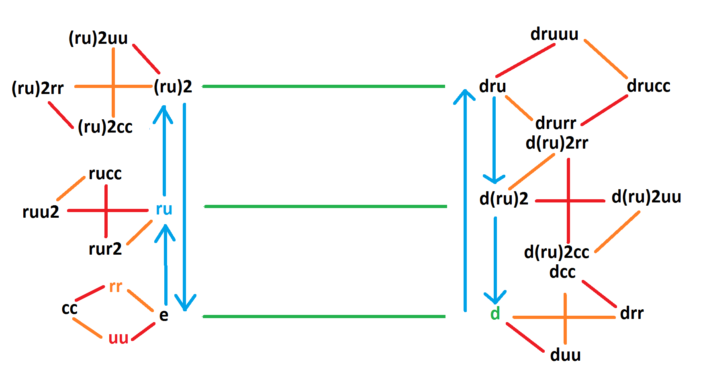

```{r setup, include=FALSE}
library(magrittr)
library(igraph)
library(DiagrammeR)
source('test.R')
knitr::opts_chunk$set(echo = TRUE)
```

## Rotations on a Cube

In this article we consider a cube and the discrete rotation we can perform on it.

A cube has 6 faces and 8 vertices.

Here we try to formalize this property by introducing 3 transformations: move up, move right and rotate clockwise. Which transform the whole cube by rotating up, right and clockwise.

```{r rotations, echo = FALSE}
rot_up <- cyc(c(1, 5, 7, 3), c(2, 6, 8, 4)) %>% as.cycle
rot_right <- cyc(c(1, 2, 6, 5), c(3, 4, 8, 7)) %>% as.cycle
rot_cck <- cyc(c(1, 2, 4, 3), c(5, 6, 8, 7)) %>% as.cycle
u <- rot_up
r <- rot_right
c <- rot_cck
cat(' Rotate up', as.character(rot_up), '\r\n',
    'Rotate right', as.character(rot_right), '\r\n',
    'Rotate clockwise', as.character(rot_cck))
```

We are interested in the group R generated by these 3 global rotations. 
More elements from R the rotation group:

```{r rotation-products}
c(
  rot_right * rot_right, # order 4
  rot_right * rot_up,# p1
  rot_right * rot_cck,
  
  rot_up * rot_right,
  rot_up * rot_up, # order 4
  rot_up * rot_cck, # == p1
  
  rot_cck * rot_right, # == p1
  rot_cck * rot_up,
  rot_cck * rot_cck) # order 4

```


## Subgroup generated by the squares: SQ2

Let's analyze the products. First we will analyze the squares.

```{r prod-squares, echo = FALSE}
# elements
rr <- rot_right * rot_right
uu <- rot_up * rot_up
cc <- rot_cck * rot_cck
# all the group elements
SQ2 <- c(as.word(rr/rr), rr, uu, cc)

cat('rr: ', as.character(rr %>% as.cycle), '\r\n',
    'uu: ', as.character(uu %>% as.cycle), '\r\n',
    'cc: ', as.character(cc %>% as.cycle), '\r\n', sep = '')
```

**definition** These 3 elements + identity form a group of order 4 that we note SQ2.

### Structure of SQ2

They form a group of order 4 generated by rr and uu and ~ (Z/2Z)^2. 

```{r prod-squares-structure}
# isomorphic to Z/2Z^2
all(
  rr*uu == cc, # rr and uu generate the whole group
  rr*uu == uu*rr, # they commute
  rr^2 == as.cycle(), # they are order 2
  uu^2 == as.cycle())
```

Also it is a *normal subgroup* of R.

```{r square-normal}
# normal subgroup
all(
  rr^u == cc,
  rr^r == rr,
  rr^c == uu,
  
  uu^u == uu,
  uu^r == cc,
  uu^c == rr
)
```

### Structure of R/SQ2

**Exploration** Here we list a few classes of R/\<uu, rr\>:

* \<uu, rr\>
```{r, echo = FALSE}
SQ2
```

* r\*\<uu, rr\>
```{r, echo = FALSE}
r*SQ2
```

* u\*\<uu, rr\>
```{r, echo = FALSE}
u*SQ2
```

* c\*\<uu, rr\>
```{r, echo = FALSE}
c*SQ2
```

We can add a few more classes:

* ru \* \<uu, rr\>
```{r, echo = FALSE}
ru <- r*u
r*u * SQ2
```

* (ru)^2^ \* \<uu, rr\>
```{r, echo = FALSE}
cat('****    (ru)^2 * <uu, rr>', '\r\n')
(r*u)^2 * SQ2
```

**Property** \<ru\>\*SQ2 is a normal subgroup of order 3 in R/SQ2.

>We can see that ru\*SQ2 generates a group of order 3 in R/SQ2. To show that this group is normal in R/SQ2 we need just check with the conjugation by u and r since they generate R, so their classes also generate R/SQ2:

```{r normality-ruSQ2}
all(
  (r*u)^r == (r*u)^2*uu,
  (r*u)^u == (r*u)^2*cc
)
```

> So R/SQ2 can be quotiented by \<ru\*SQ2\>. 

**Property** (R/SQ2)/\<ru\*SQ2\> is isomorphic to C(2)

* \<ru\*SQ2\>
  ```{r, echo = FALSE}
  cat('{\r\n')
  SQ2
  r*u*SQ2
  (r*u)^2*SQ2
  cat('}')
  ```

* rSQ2\*\<ru\*SQ2\>
  ```{r, echo = FALSE}
  cat('{\r\n')
  r*SQ2
  u*SQ2 # r*r*u*SQ2 == u*SQ2
  c*SQ2 # r*(r*u)^2*SQ2 == c*SQ2
  cat('}')
  ```

  We verify that r\*r\*u is in u\*SQ2, r\*(r\*u)^2 in c\*SQ2

  ```{r}
  all(
    r*r*u == u*cc,
    r*(r*u)^2 == c*cc
    )
  ```

>Since
>
1.  u\*SQ2 in r \* SQ2 \* \<ru\*SQ2\>
2.  u\*SQ2 in u \* SQ2 \* \<ru\*SQ2\>
>
Then r \* SQ2 \* \<ru\*SQ2\> ==  u \* SQ2 \* \<ru\*SQ2\>
Similarly r \* SQ2 \* \<ru\*SQ2\> ==  c \* SQ2 \* \<ru\*SQ2\>
>
>
So (R/SQ2)/\<ru\*SQ2\> is generated by r\*\<ru\*SQ2\>.
Furthermore we have
>
1.  r\*ru\*SQ2 \in \<ru\*SQ2\>
2.  r\*ru\*SQ2 == u\*SQ2
2.  u\*SQ2 \* u\*SQ2 == u^2\*SQ2 == SQ2
3.  SQ2 \in \<ru\*SQ2\>
>
Then: (r\*\<ru\*SQ2\>) ^ 2 == \<ru\*SQ2\>
>
From this we can deduce that (R/SQ2)/\<ru\*SQ2\> is isomorphic to Z/2Z.

**Property** The elements of R/SQ2 are: SQ2, r\*SQ2, u\*SQ2, c\*SQ2, ru\*SQ2, (ru)^2\*SQ2

**Property** R has 24 elements, the full list being shown below

```{r echo = FALSE}
R <- c(SQ2, r*SQ2, u*SQ2, c*SQ2, r*u*SQ2, ((r*u)^2)*SQ2)
R
```

### $R = <rcc, ru> \rtimes SQ2$

We know that R has 24 elements and that it can be quotiented by SQ2 (isomorph to Z/2Z ^2). We know that the quotient is isomorph to S3.

$$0 \rightarrow SQ2 \rightarrow R \rightarrow S3 \rightarrow 0$$

Now we would like to know if R is a semi-direct product of SQ2 and S3.
We need to see if we can embed S3 in R such that

$$ 0 \rightarrow S3 \rightarrow R \rightarrow R/SQ2 = 0 \rightarrow R/SQ2$$

S3 is generated by an element of order 3 p and an element of order 2 a such that the action of a on p gives p2.

Let's try to find an element of order 3 in R that doesnt belong in SQ2. It turns out that there are exactly 8 elements of order 3 and that none belongs to SQ2. The list of all the elements of order 3 is:
[ru], [ru]^2

```{r all-order3}
r*u*SQ2
r*u*r*u*SQ2
```

Let's take for example r\*u. Now we need to find an element a of order 2 such that $a^{-1}(ru)a = (ru)^2$. Also a cannot belong to SQ2.

We have $[a^{-1}][ru][a] = [ru]^2$
We can see that $[r][ru][r] = [ru]^{2}$
By going through the elements of [r] we can see that:
r\*cc is of order 2 and that it acts as we want on r\*u
```{r}
(r*u)^(r*cc) == (r*u)^2

```

**Definition** Let $G \subset R$ be the subgroup of R generated by ru, rcc. G is isomorphic to S3 by the map $ru \mapsto r$, $rcc \mapsto s$.

> We verify that ru is of order 3, rcc is of order 2 and $(rcc)^{-1}rurcc = (ru)^2$
> So G verifies the same generator/relation presentation as S3.

The **elements of G** are:
```{r, echo = FALSE}
G <- c(r/r, r*cc, (r*cc)^(r*u), r*cc^((r*u)^2), r*u, r*u*r*u)
G
```

**Note** The groups G^uu, G^rr and G^cc are also isomorphic to S3 and can also be used to form the semi-direct product.

```{r, echo = FALSE}
cat('G^uu\r\n')
G^uu
cat('G^rr\r\n')
G^rr
cat('G^cc\r\n')
G^cc
```

**Property** There is a group isomorphism $R/SQ2 \rightarrow G$ that maps ruSQ2 to ru and rSQ2 to rcc. This isomorphism splits the sequence $0 \rightarrow SQ2 \rightarrow R \rightarrow R/SQ2 \rightarrow 0$.

The **action of G on SQ2** is given by
```{r}
all(
  uu^ru == rr,
  rr^ru == cc,
  cc^ru == uu,
  uu^(r*cc) == cc,
  rr^(r*cc) == rr,
  cc^(r*cc) == uu
  )
```


## Normal subgroup C3
### \<ru*SQ2\> is normal in R/SQ2

We know that \<ru*SQ2\> is normal in R/SQ2
We have <ru*SQ2> =
```{r, echo = FALSE}
cat('{\r\n')
SQ2
r*u*SQ2
(r*u)^2*SQ2
cat('}')
```

Or if we put all the elements together:

```{r}
C3 <- c(SQ2,
  r*u*SQ2,
  (r*u)^2*SQ2)
C3
```

### Definition of C3 and normality

Let C3 = $SQ2 \cup ruSQ2 \cup (ru)^2SQ2$ = ${\pi_{SQ2}}^{-1}\{<ruSQ2>\}$
Let g be an element of R and h be an element of C3.

We want to see if inv(g)hg is \in C3
[inv(g)hg] = [invg][h][g]
[h] \in <ruSQ2> and <ruSQ2> normal in R/SQ2 so
[inv(g)hg] \in <ruSQ2>
Implies inv(g)hg in C3

So C3 is normal in R.

And $C3 \sim C(3) \rtimes C(2)^2$, $R/C3 \sim C(2)$


### $R = Z/2Z \rtimes C3$

Let's show that there is an element d in R of order 2 such that R = $<d> \rtimes C3$

For that we need 

* $<d> \cap C3 = \{e\}$ Since d has order 2 and R/SQ3 has also order 2 we have
$<d> \cap C3 = \{e\} \iff d \in \mathrm{uSQ2} \cup \mathrm{rSQ2} \cup \mathrm{cSQ2}$
* d and C3 generate R. This is automatic if d verifies the point just before than this is automatic !

This is $\mathrm{uSQ2} \cup \mathrm{rSQ2} \cup \mathrm{cSQ2}$

```{r echo = FALSE}
u*SQ2
r*SQ2
c*SQ2
```

We see that urr fits the profile !

```{r echo = FALSE}
urr <- u*r*r
d <- urr
```

Let's see the action of urr on the generators of C3: uu, rr, ru

```{r echo = TRUE}
all(
  uu^urr == uu,
  rr^urr == cc,
  ru^urr == ru^2
)
```

## Structure of R

### Elements and their orders

R has 24 elements, the full list being 

```{r echo = FALSE}
R <- c(SQ2, r*SQ2, u*SQ2, c*SQ2, r*u*SQ2, ((r*u)^2)*SQ2)
R
```

We can see that R has:

| Order  | 1 | 2 | 3 | 4 |
|--------|---|---|---|---|
| Number | 1 | 9 | 8 | 6 |

```{r, echo = FALSE}
perm_orders <- permorder(c(SQ2, r*SQ2, u*SQ2, c*SQ2, r*u*SQ2, ((r*u)^2)*SQ2))
sum(perm_orders == 2)
sum(perm_orders == 4)
sum(perm_orders == 3)
cat('9 elements of order 2: \r\n')
R[c(2, 3, 4, 7, 8, 10, 12, 14, 15)]
cat('8 elements of order 3: \r\n')
R[17:24]
cat('6 elements of order 4: \r\n')
R[c(5, 6, 9, 11, 13, 16)]

```

Elements of order 2 details:
3 are square of elements of order 4:

```{r, echo = FALSE}
R[c(2, 3, 4)]
```

6 are not square of elements of order 4:

```{r, echo = FALSE}
R[c(7, 8, 10, 12, 14, 15)]
```

### Normal Decomposition of R

$$ 0 \lhd <uu> \lhd SQ2 \lhd C3 \lhd R $$

Which we can also write as

$$ 0 \lhd <uu> \lhd <rr, uu> \lhd <rr, uu> \ltimes <ru> \lhd <rr, uu> \ltimes  <ru>  \ltimes <urr>$$

Which is isomorphic to the following

$$ 0 \lhd C(2) \lhd C(2)^2 \lhd C(3) \rtimes C(2)^2 \lhd C(2) \rtimes C(3) \rtimes C(2)^2 $$


### Normal Lattice


**Property** There are no proper subgroups of SQ2 that are normal in R.

> Proof by checking manually the action of ru on SQ2.


**Property** The only non-trivial normal subgroup of R/SQ2 is \<ru\*SQ2\> 
     
> R/SQ2 is a group of order 6 isomorphic to S3. We know S3 has only one proper normal subgroup, which is composed of the 2 elements of order 3 and the identity. So the only proper normal subgroup of R/SQ2 is $<ru \dot SQ2>$


**Property** SQ2, \<ru\>\*SQ2 and R are the only normal subgroups of R that contain SQ2

> Let's list the normal subgroups of R that contain SQ2. We know that they are in correspondance with the normal subgroups of R/SQ2 which are SQ2, \<ru\*SQ2\>,  R/SQ2. So all the normal subgroups of R that contain SQ2 are SQ2, \<ru\>\*SQ2 and R. 
>
SQ2 is isomorphic to C(2) \* C(2)

**Property** The sequence $0 \rightarrow SQ2 \rightarrow <ru>SQ2 \rightarrow C(3) \rightarrow 0$ does not split.

>\<ru\>\*SQ2 is a group of size 12. SQ2 is a normal subgroup of \<ru\>\*SQ2 and the quotient \<ru\>\*SQ2/SQ2 is isomorphic to C(3). Thus it is an extension $0 \rightarrow SQ2 \rightarrow <ru>SQ2 \rightarrow C(3) \rightarrow 0$. This extension is right split with the morphism $C(3) \rightarrow <ru>SQ2$ that sends 1 to ru.
So \<ru\>\*SQ2 is a semi-direct product $<ru> \ltimes SQ2$ with the action of ru being non trivial. If the action $0 \rightarrow SQ2 \rightarrow <ru>SQ2 \rightarrow C(3) \rightarrow 0$ was split, the action of ru would be an inner automorphism of SQ2, but SQ2 is abelian and its only inner automorphism is the identity morphism. Since the action of ru is not the identity, we know that this extension is not split.
6


**Property**  All the non-trivial normal subgroups of R contain SQ2
    
> Let G be a non-trivial normal subgroups of R. Let's consider $G \cap SQ2$, it is a normal subgroup of R sitting inside SQ2. According to the few properties in this section we have $G \cap SQ2 = \emptyset$ or $G \cap SQ2 = SQ2$. In the latter case the property is already proved, so let's assume $G \cap SQ2 = \emptyset$ and we will try to show a contradiction.
>
Both of them are normal so they commute.
Moreover G*SQ2 is a subgroup of R:
$\forall g, h \in G, \forall k, n \in SQ2, gk\times hn = gh \times kn \in G \mathrm{SQ2}$
It is a normal subgroup of R because $\forall r \in R, g \in G, n \in \mathrm{SQ2}, r^{-1}gnr = r^{-1}grr^{-1}nr = (r^{-1}gr)(r^{-1}nr) \in G\mathrm{SQ2}$ by normality of both subgroups.
So G\*SQ2 is a normal subgroup containing R. It is either SQ2, C3 or R.
>
If it is SQ2 then G contains just the identity so the result is proved.
>
If GSQ2 is C3. Then we have the following extension for C3 $0 \rightarrow SQ2 \rightarrow C3 \rightarrow G \rightarrow 0$ and this sequence is both right and left split so that $C3 = G \times SQ2 \sim C(3) \times C(2)^2$ which is impossible since C3 is not commutative. And also we have shown that this sequence doesn't split in the last property.
>
If G\*SQ2 is R then we have the following split exact sequence for R:
$$0 \rightarrow SQ2 \rightarrow R \rightarrow G \rightarrow 0$$
>
But R already verifies this exact sequence $$0 \rightarrow SQ2 \rightarrow R \rightarrow S3 \rightarrow 0$$
>
We know that this exact sequence splits on the right with an action on Aut(SQ2) which is not inner. So this exact sequence cannot be split. And G\*SQ2 cannot be R.
>
Conclusion: $G \cap SQ2 = SQ2$

**All the normal subgroups of R** are {e}, SQ2, \<ru\>\*SQ2 and R.

```{r normal-lattice, echo = FALSE}
grViz('
digraph boxes_and_circles {

  graph [overlap = true, fontsize = 10, rankdir = "BT"]

  node [shape = circle,
        fontname = Helvetica,
        fillcolor = cyan,
        style = filled]
  e; SQ2; C3 [label = "<ru>SQ2"]; R [width = 2, fontsize = 22]

  e->SQ2->C3->R
}
')
```


### Presentations of R

Using the composition sequence $$ 0 \lhd <uu> \lhd <rr, uu> \lhd <rr, uu> \ltimes <ru> \lhd <rr, uu> \ltimes  <ru>  \ltimes <urr>$$ and making profit that all the extensions are semi-direct products we get the following presentation:

$$<(uu)^2, (rr)^2, (ur)^3, (urr)^2, uu \cdot rr = rr \cdot uu, rr \cdot ru = ru \cdot uu \cdot rr, uu \cdot ru = ru \cdot rr \\
uu \cdot urr= urr \cdot uu, rr \cdot urr= urr \cdot uurr, ru \cdot urr = urr \cdot (ru)^2>$$

Or again by writing i = uu, j = rr, k = ur, l = urr

$$<i^2, j^2, k^3, l^2, ij=ji, ik = kj, jk = kij,  il=li, jl = lij, kl=lk^2>$$

### Cayley Graph of R



### Other quotient of R

We also have 

$$ 0 \rightarrow <ruSQ2> \rightarrow R/SQ2 \rightarrow Z/2Z \rightarrow 0 $$

And since C3 is also normal in R we have:

We also have 

$$ 0 \rightarrow C3 \rightarrow R \rightarrow Z/2Z \rightarrow 0 $$


### Decomposition of S3

We have

$$ 0 \rightarrow Z/3Z \rightarrow S3 \rightarrow Z/2Z \rightarrow 0$$

