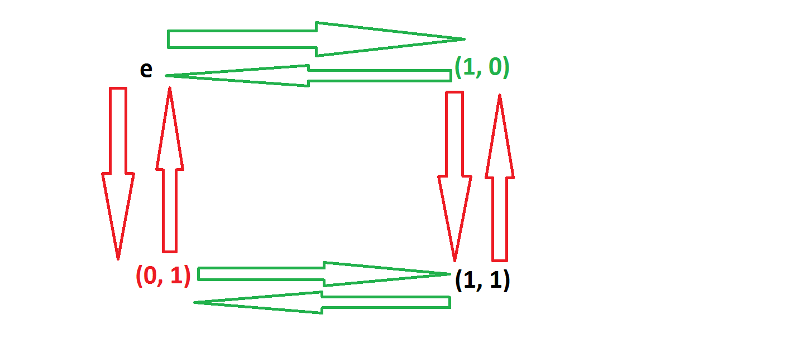

```{r setup, include=FALSE}
knitr::opts_chunk$set(echo = TRUE)
```

## An easy one

Only 4 elements lel

## 2 generators

we call them (1, 0) and (0, 1)

## the generator diagram



## The Automorphism group

Abelian so, no inner automorphisms.

Z/2Z is of order 4. It has 1 element of order 1 and 3 elements of order 2. 
Since

* an automorphism must map each element to an element of same order
* cannot map 2 elements to the same image
* uniquely defined by its image on generators

we have $\phi(1, 0) \in \{(1, 0), (0, 1), (1, 1)\}$ 3 choices and then 2 choices for $\phi(0, 1)$ so at max we have 6 automorphisms.

In order to check that $\phi$ is an automorphism we need just check that $\phi(a+b) = \phi(a) + \phi(b)$ for all a,b in Z/2Z^2. So that is 16 combinations. Since by the way the automorphism is constructed we don't need to check the image of the identity so that leaves: 3\*3 = 9 possibilities. We don't need to check the image of an element with itself since we already know it will have order 2. so that leaves 3\*2 = 6 combinations. Since it commutes we need to check each pair once so that leaves 3\*2/2 = 3 checks to do.

Let's just check out all the possibilities:

1. $\phi(1, 0) = (1, 0)$
    1. $\phi(0, 1) = (0, 1)$
    $\phi(1, 1) = \phi((1,0)+(0, 1)) \equiv \phi(1,0) + \phi(0, 1) = (1, 0) + (0, 1) = (1, 1)$ !! $\phi$ is just the identity.
    2. $\phi(0, 1) = (1, 1)$
          1. $\phi((1, 0) + (0, 1)) \equiv \phi(1, 0) + \phi(0, 1) = (1, 0) + (1, 1) = (0, 1)$
        2. $\phi((1, 0) + (1, 1)) \equiv \phi(0, 1) = (1, 1) = (1, 0) + (0, 1) = \phi(1, 0) + \phi(1, 1)$
        3. $\phi((0, 1) + (1, 1)) = \phi((1, 0)) = (1, 0) = (1, 1) + (0, 1) = \phi(0,1) + \phi(1, 1)$
    
2. $\phi(1, 0) = (0, 1)$
      1. $\phi(0, 1) = (1, 0)$
      2. $\phi(0, 1) = (1, 1)$
3. $\phi(1, 0) = (1, 1)$
      1. $\phi(0, 1) = (1, 0)$
      2. $\phi(0, 1) = (0, 1)$
